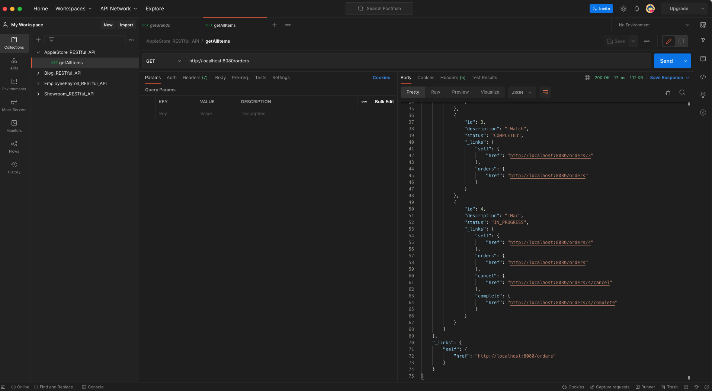
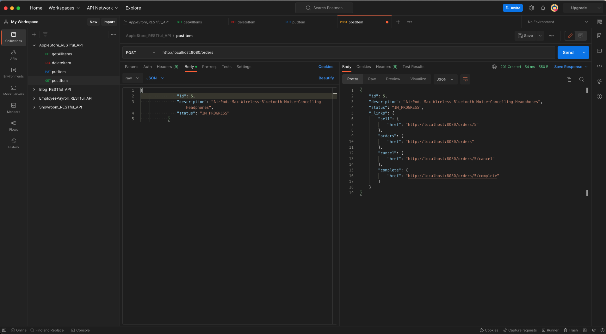
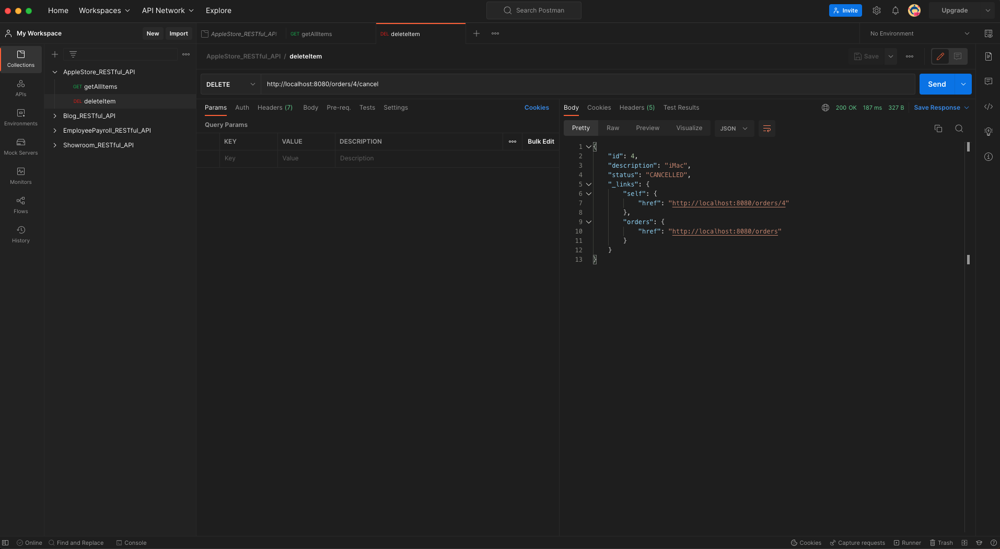

# Project Title:

Store Order Fulfilment System (A RESTful API for Spring Boot)

## 1. What is the project?

> "To show how to cope with state changes without triggering breaking changes in clients, imagine adding a system that fulfills orders."

> "Orders must go through a certain series of state transitions from the time a customer submits an order and it is either fulfilled or cancelled."

#### This is an Store Order Fulfilment RESTful API for Spring Boot, which performs CRUD operations on an in-memory database.

#### An implementation of a SPRING quide: "Building REST services with Spring".

## 2. Tech Stack:

- Java 17
- Spring MVC
- Spring Boot
- Spring HATEOAS
- Java JPA
- H2 Database.
- JSON
- Postman

## 3. Installing:

i. Clone the git repo

```
https://github.com/AAdewunmi/Store-Order-Fulfilment-System.git
```

ii. Open project folder

iii. Explore

## 4. How To Use

i. Open project in preferred IDE (I'm using SpringToolSuit4) 

ii. Run as a Spring Boot App

iii. Test RESTful API end points using Postman for CRUD operations:

- Get All Orders
- Get Order By ID
- Post Order
- Put Order
- Delete Order

## 5. Demo

#### CRUD Operations:

- Get All Orders



- Get Order By ID


- Post Order



- Put Order


- Delete Order




## 6. Contributing:

Pull requests are welcome. For major changes, please open an issue first to discuss what you would like to change at:

Spring Guide Github Repo: https://github.com/spring-guides/tut-rest.


## 7. Original Creator:

Author:  SPRING by VMware Tanzu

Tutorial Name: "Building REST services with Spring"

Spring URL: https://spring.io/guides/tutorials/rest/
 
Github Project Name: Building REST Services with Spring

Github URL: https://github.com/spring-guides/tut-rest
